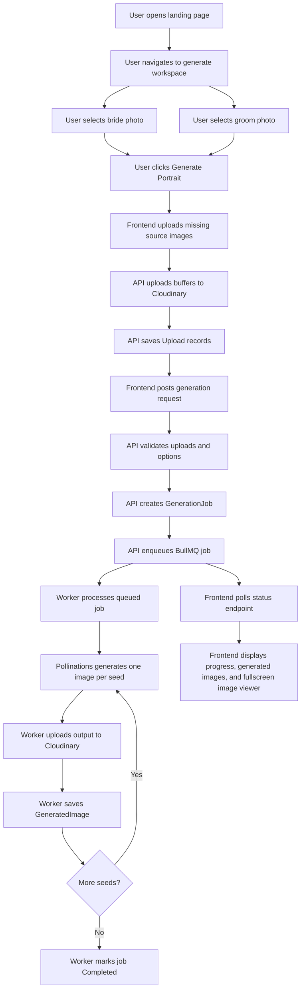
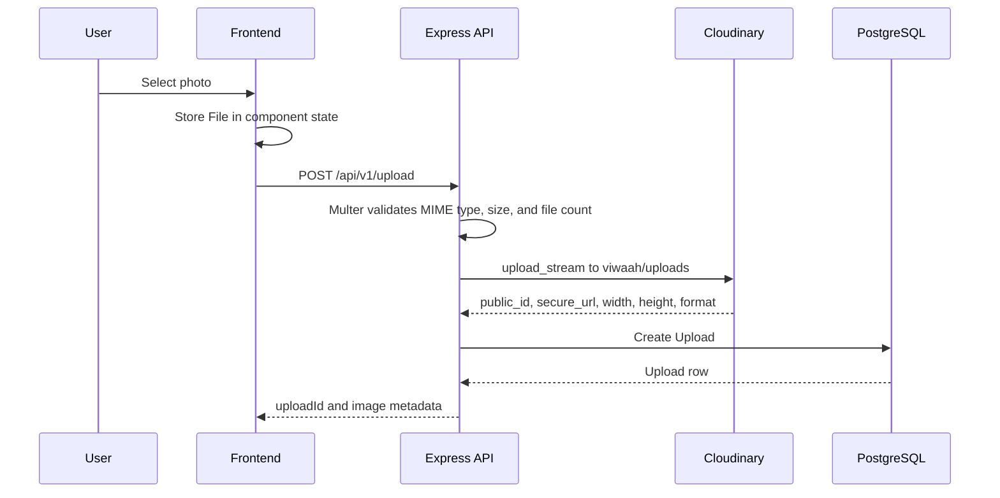
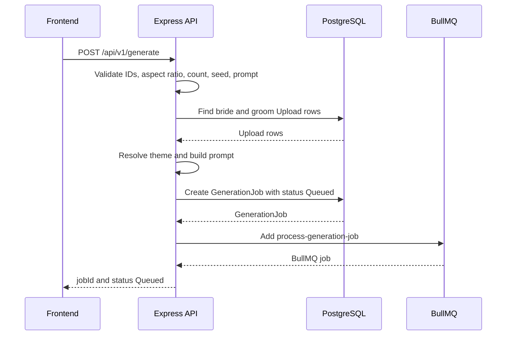
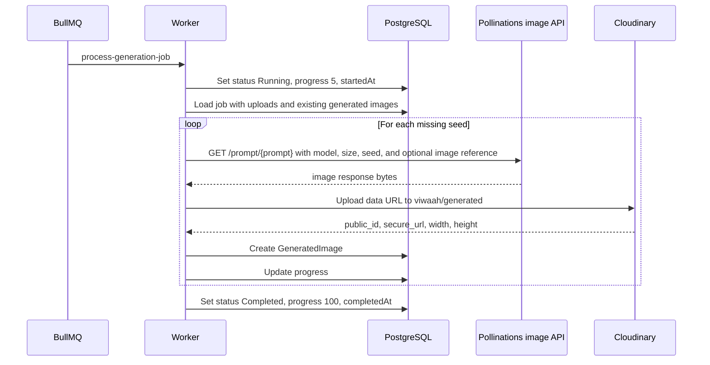
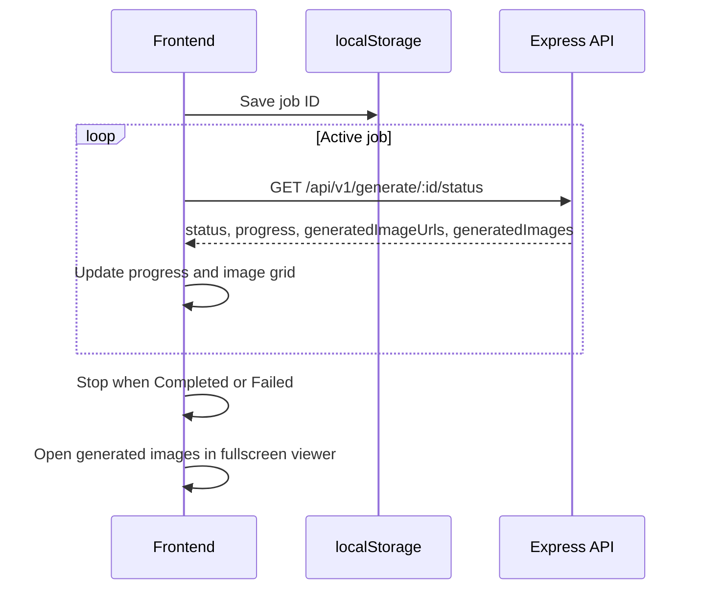
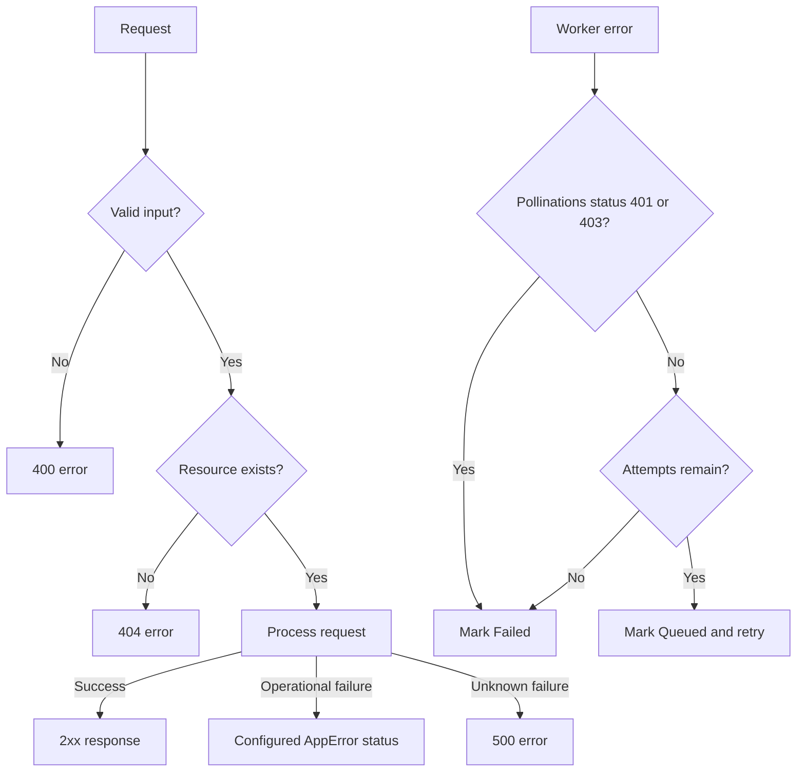

# Application Flow

This document describes the implemented user and job flows. See [Data API](./data_api.md) for endpoints and [Architecture](./architecture.md) for system boundaries.

## High-Level Flow

## Upload Flow

Notes:

- The upload API accepts JPEG, PNG, and WebP.
- The limit is one file per request and 10 MB per file.
- If upload metadata cannot be saved after Cloudinary upload, the service deletes the uploaded Cloudinary image.

## Generation Request Flow

Theme resolution:

- Canonical themes are `South Indian`, `Royal Palace`, and `Beach Wedding`.
- Known aliases are mapped before saving.
- Unknown themes fall back to `South Indian`.
- The frontend currently offers additional labels that are not backend canonical themes; unsupported labels use the fallback behavior.

## Worker Flow

Retry behavior:

- Queue jobs have 3 attempts.
- Backoff is exponential with a 30 second initial delay.
- Provider errors with status `401` or `403` are treated as non-retryable and mark the job `Failed`.
- Retryable failures set the database job back to `Queued` with progress `5`.

## Frontend Polling

Details:

- The key is `viwaah:last-generation-job-id`.
- Polling starts 500 ms after job creation and repeats every 2.5 seconds.
- On page load, the workspace tries to restore the last job from `localStorage`.
- Generated image thumbnails open a responsive fullscreen viewer with zoom controls, drag panning when zoomed, previous/next navigation, ESC/outside-click close, metadata, original Cloudinary download, and open-in-new-tab actions.

## Error Flow

