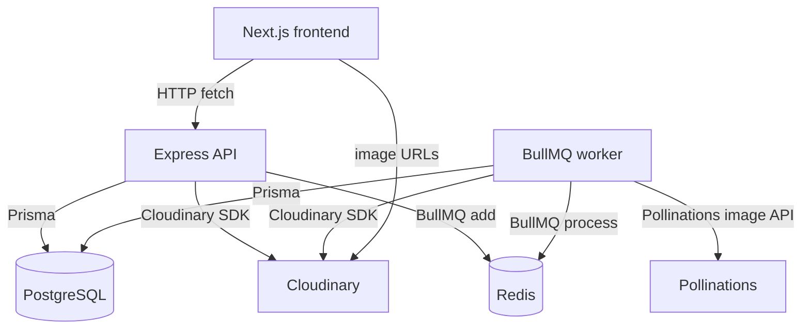
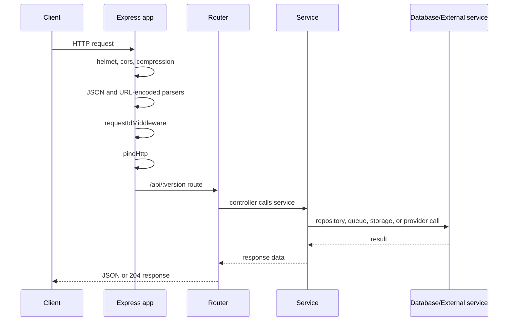
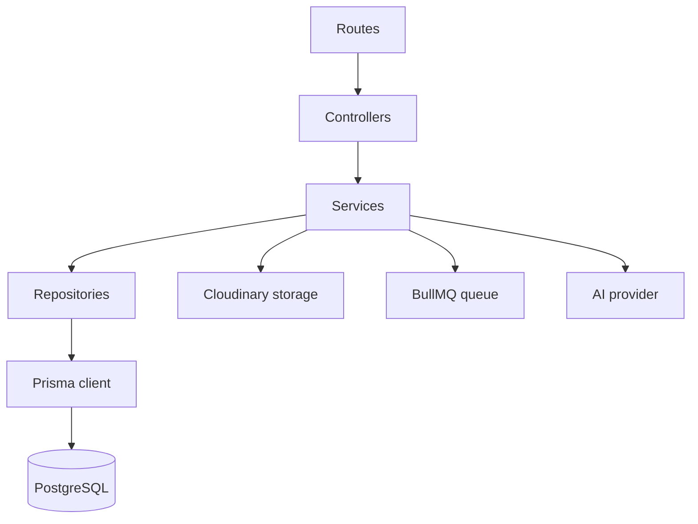
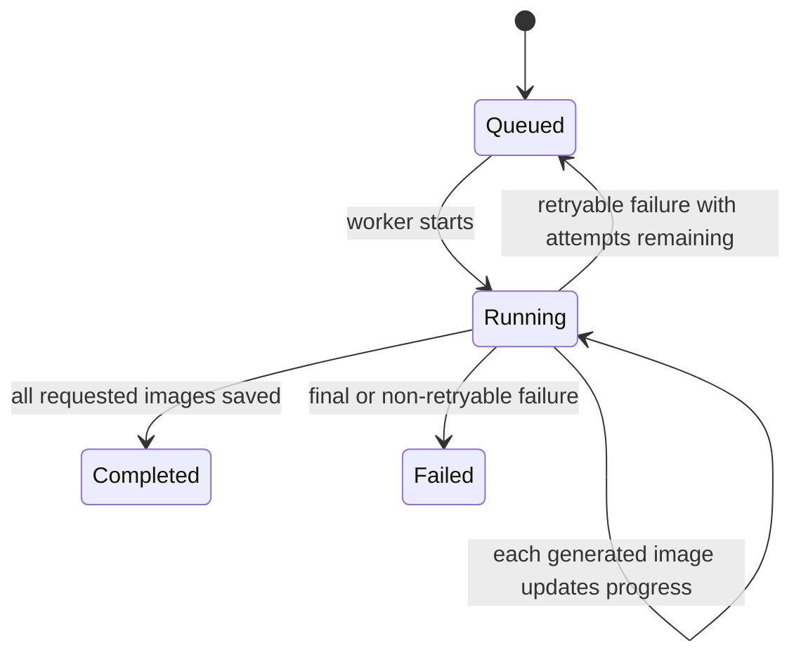

# Architecture

## Overview

ViWaah is an Nx monorepo with two applications:

- `apps/web`: Next.js 16 frontend.
- `apps/api`: Express 5 API and in-process BullMQ worker.

The API uploads images to Cloudinary, stores metadata in PostgreSQL with Prisma, enqueues generation jobs in BullMQ, and delegates image generation to an AI provider abstraction. The current provider implementation is Pollinations image generation.



Related docs: [Data API](./data_api.md), [Schema](./schema.md), [Application flow](./appflow.md).

## Project Structure

```text
apps/api/src/
├── ai/              # Provider interface, Pollinations provider, prompt themes
├── config/          # Environment parsing and app config
├── controllers/     # Express request handlers
├── database/        # Prisma client singleton
├── middleware/      # Error, request ID, upload, and 404 middleware
├── queues/          # BullMQ queue and Redis connection config
├── repositories/    # Prisma query helpers
├── routes/          # API route registration
├── services/        # Business logic and health checks
├── storage/         # Cloudinary wrapper
├── utils/           # AppError, async handler, logger
└── workers/         # Generation worker startup and processor

apps/web/src/
├── app/             # Next.js App Router pages and global CSS
├── components/      # UI and design components
├── features/        # Landing and generation features
└── lib/             # Shared frontend utilities
```

There is a root `packages/` workspace entry, but no shared packages are currently present.

## Frontend

| Route | File | Purpose |
|---|---|---|
| `/` | `apps/web/src/app/page.tsx` | Renders the landing page |
| `/generate` | `apps/web/src/app/generate/page.tsx` | Renders the generation workspace |
| `/api/hello` | `apps/web/src/app/api/hello/route.ts` | Default/sample Next route, not used by the product flow |

The generation workspace:

- Uploads images through `POST /upload`.
- Creates jobs through `POST /generate`.
- Polls `GET /generate/:id/status` every 2.5 seconds after an initial 500 ms delay.
- Stores the last job ID in `localStorage` under `viwaah:last-generation-job-id`.
- Uses `NEXT_PUBLIC_API_BASE_URL`, defaulting to `http://localhost:4000/api/v1`.

The visible style options include values beyond the backend's three canonical themes. Backend aliases map `Royal`, `Traditional`, `Temple`, `Palace`, `Beach`, and `Reception` to canonical themes. Unknown values such as `North Indian`, `Christian`, `Muslim`, and `Custom` currently fall back to `South Indian`.

## Backend

### Express App

The Express app is created in `apps/api/src/app.ts`.



Middleware order:

| Order | Middleware | Purpose |
|---|---|---|
| 1 | `helmet()` | Security headers |
| 2 | `cors({ origin: config.corsOrigin })` | CORS |
| 3 | `compression()` | Response compression |
| 4 | `express.json()` | JSON parsing |
| 5 | `express.urlencoded({ extended: true })` | Form body parsing |
| 6 | `requestIdMiddleware` | Request ID header and request property |
| 7 | `pinoHttp()` | Request logging |
| 8 | API router | Product endpoints |
| 9 | `notFoundHandler` | 404s |
| 10 | `globalErrorHandler` | Structured errors |

### Route Layers



The route files are:

- `health.routes.ts`
- `upload.routes.ts`
- `generation-job.routes.ts`

See [Data API](./data_api.md) for endpoint details.

## Database

Prisma defines four models: `User`, `Upload`, `GenerationJob`, and `GeneratedImage`.

`User` exists in the schema, but authentication is not implemented. `Upload.userId` and `GenerationJob.userId` are nullable, allowing unauthenticated MVP usage.

The Prisma client uses `@prisma/adapter-pg` and is cached on `globalThis` outside production to reduce connection churn during development.

See [Schema](./schema.md).

## Queue and Worker

The queue is defined in `apps/api/src/queues/generation.queue.ts`.

| Setting | Value |
|---|---|
| Queue name | `generation` |
| Job name | `process-generation-job` |
| Job ID | Same as `GenerationJob.id` |
| Attempts | `3` |
| Backoff | Exponential, `30000` ms |
| `removeOnComplete` | `true` |
| `removeOnFail` | `false` |
| Worker concurrency | `2` |
| Worker lock duration | `600000` ms |



The API process starts workers in `main.ts` through `startWorkers()`, so the worker currently runs in the same Node process as the API. The code can be split into independent worker processes later, but that is not implemented.

## Image Storage

Cloudinary integration lives in `apps/api/src/storage/cloudinary.ts`.

| Function | Use |
|---|---|
| `uploadImageBuffer` | Uploads source upload buffers to `viwaah/uploads` |
| `uploadImageUrl` | Uploads generated image URLs or data URLs to `viwaah/generated` |
| `deleteImage` | Deletes a Cloudinary image by public ID |

## AI Provider

The provider abstraction is defined in `apps/api/src/ai/providers/provider.interface.ts`.


The only implemented provider is `PollinationsProvider` in `pollinations.provider.ts`.

| Field | Current value |
|---|---|
| Provider name | `pollinations` |
| Default model | `flux` |
| API endpoint | `GET https://image.pollinations.ai/prompt/{prompt}` |
| Output handling | Reads the image response body, converts it to a data URL, then uploads to Cloudinary |
| Size mapping | `1:1` -> `512x512`; landscape -> `768x512`; portrait -> `512x768` |

The provider sends source image URLs in the generated wedding prompt and sends width, height, seed, model, and bearer authentication to Pollinations. When `POLLINATIONS_IMAGE_MODEL=kontext`, the bride source image is also sent as Pollinations' `image` reference parameter, but that model is only usable on Pollinations accounts/endpoints that expose it.

## Health and Shutdown

`GET /health` checks:

- PostgreSQL with `SELECT 1`.
- Redis/BullMQ through the queue health service.
- AI provider configuration through `generatorService.healthCheck()`.

`main.ts` handles `SIGINT`, `SIGTERM`, unhandled promise rejections, and uncaught exceptions by closing the HTTP server and then closing workers.

## Deployment State

The repository contains local development code only. Dockerfiles, Kubernetes manifests, CI/CD workflows, production worker separation, monitoring, and rate limiting are not currently implemented.
