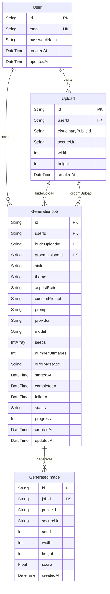
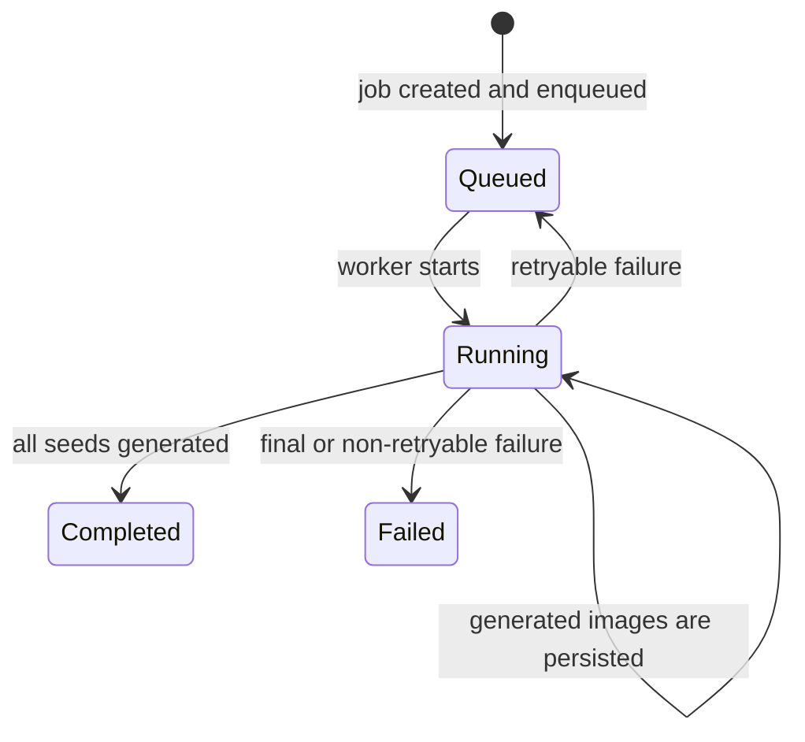

# Database Schema

ViWaah uses PostgreSQL with Prisma 7. The schema is defined in `apps/api/prisma/schema.prisma`.

Related docs: [Architecture](./architecture.md), [Data API](./data_api.md), [Application flow](./appflow.md).

## Entity Relationship Diagram

`userId`, `customPrompt`, `errorMessage`, lifecycle timestamps, generated image dimensions, `seed`, and `score` are nullable where marked optional in Prisma.

## Models

### User

Defined for future authentication. No auth routes, session handling, or user-scoped request behavior are implemented yet.

| Field | Type | Constraints |
|---|---|---|
| `id` | `String @db.Uuid` | Primary key, `uuid()` |
| `email` | `String` | Unique |
| `passwordHash` | `String` | Required |
| `createdAt` | `DateTime` | `now()` |
| `updatedAt` | `DateTime` | `@updatedAt` |

Relations:

- `uploads`: one user to many uploads.
- `jobs`: one user to many generation jobs.

### Upload

Stores Cloudinary metadata for source bride/groom images.

| Field | Type | Constraints |
|---|---|---|
| `id` | `String @db.Uuid` | Primary key, `uuid()` |
| `userId` | `String? @db.Uuid` | Optional FK to `User.id`, cascade delete |
| `cloudinaryPublicId` | `String` | Required |
| `secureUrl` | `String` | Required |
| `width` | `Int` | Required |
| `height` | `Int` | Required |
| `createdAt` | `DateTime` | `now()` |

Indexes:

- `@@index([userId])`

Relations:

- Optional `user`.
- `brideJobs` through the `GenerationJobBrideUpload` relation.
- `groomJobs` through the `GenerationJobGroomUpload` relation.

### GenerationJob

Tracks a generation request from queueing through completion or failure.

| Field | Type | Constraints |
|---|---|---|
| `id` | `String @db.Uuid` | Primary key, `uuid()` |
| `userId` | `String? @db.Uuid` | Optional FK to `User.id`, cascade delete |
| `brideUploadId` | `String @db.Uuid` | FK to `Upload.id`, restrict delete |
| `groomUploadId` | `String @db.Uuid` | FK to `Upload.id`, restrict delete |
| `style` | `String` | Required |
| `theme` | `String` | Required canonical theme |
| `aspectRatio` | `String` | Required |
| `customPrompt` | `String?` | Optional |
| `prompt` | `String` | Full generated prompt sent to the provider |
| `provider` | `String` | Current value is `pollinations` |
| `model` | `String` | Current default is `flux` |
| `seeds` | `Int[]` | Base seed plus sequential offsets |
| `numberOfImages` | `Int` | Database default `4`; API service default `1` |
| `errorMessage` | `String?` | Last error message |
| `startedAt` | `DateTime?` | Worker start time |
| `completedAt` | `DateTime?` | Completion time |
| `failedAt` | `DateTime?` | Final failure time |
| `status` | `String` | `Queued`, `Running`, `Completed`, or `Failed` |
| `progress` | `Int` | Default `0` |
| `createdAt` | `DateTime` | `now()` |
| `updatedAt` | `DateTime` | `@updatedAt` |

Indexes:

- `@@index([userId])`
- `@@index([brideUploadId])`
- `@@index([groomUploadId])`
- `@@index([status])`

### GeneratedImage

Stores metadata for each generated output uploaded to Cloudinary.

| Field | Type | Constraints |
|---|---|---|
| `id` | `String @db.Uuid` | Primary key, `uuid()` |
| `jobId` | `String @db.Uuid` | FK to `GenerationJob.id`, cascade delete |
| `publicId` | `String` | Cloudinary public ID |
| `secureUrl` | `String` | Cloudinary HTTPS URL |
| `seed` | `Int?` | Seed used for output |
| `width` | `Int?` | Output width when available |
| `height` | `Int?` | Output height when available |
| `score` | `Float?` | Reserved for future quality scoring |
| `createdAt` | `DateTime` | `now()` |

Indexes:

- `@@index([jobId])`

## Status Lifecycle

| Status | Set by |
|---|---|
| `Queued` | API service on creation, worker on retryable failure |
| `Running` | Worker |
| `Completed` | Worker |
| `Failed` | Worker |

Progress behavior:

| Value | Meaning |
|---|---|
| `0` | Created but not started |
| `5` | Worker started, or retryable failure reset |
| `5 + round(completed / total * 90)` | Per-image progress, capped at `95` |
| `100` | Completed or finally failed |

## Current Schema Gaps

The schema includes `User` and `GeneratedImage.score`, but there is no implemented authentication flow or quality evaluator. Those fields are reserved for future work.
